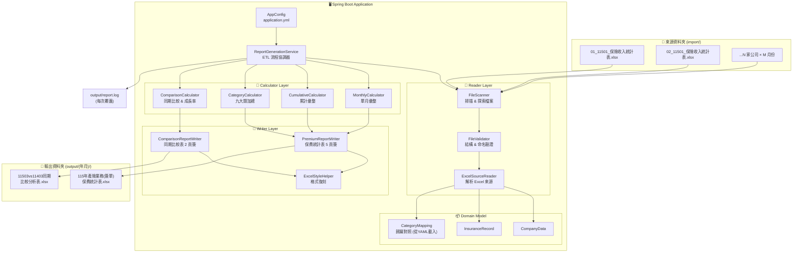
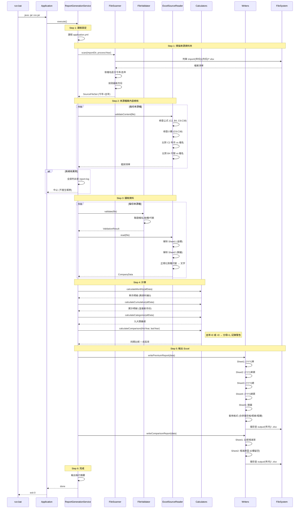
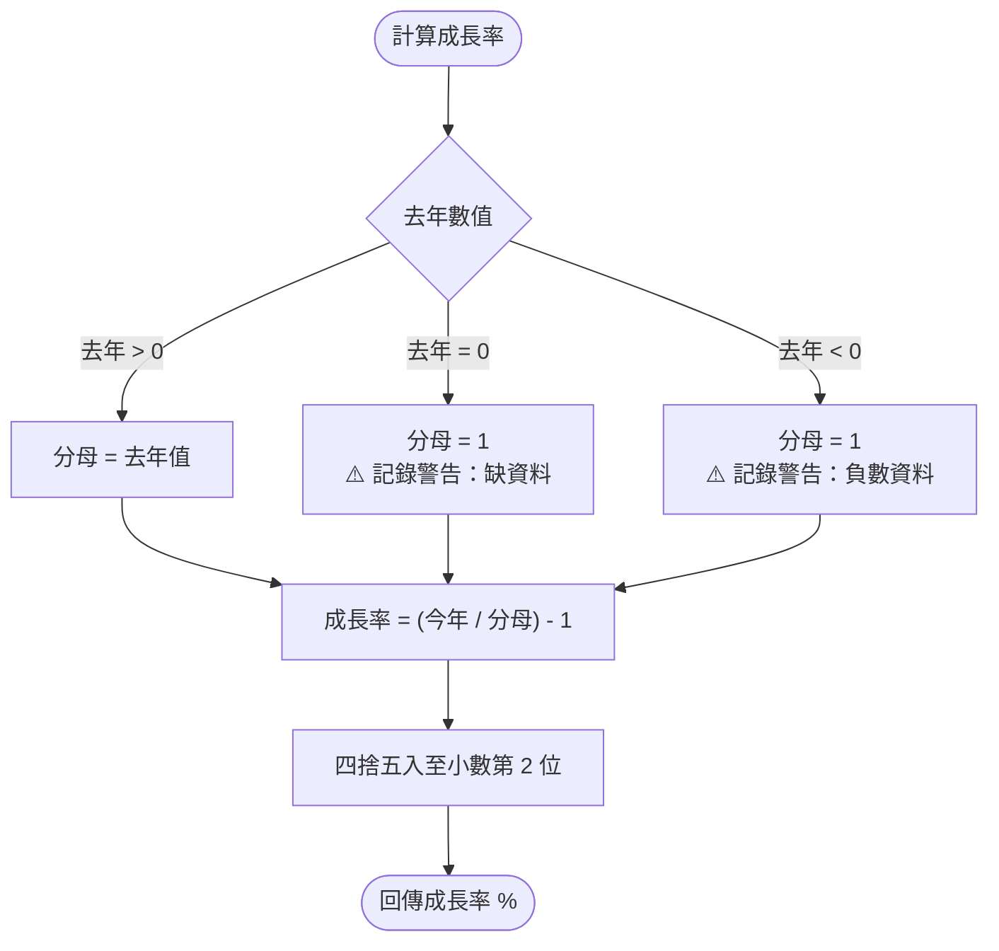
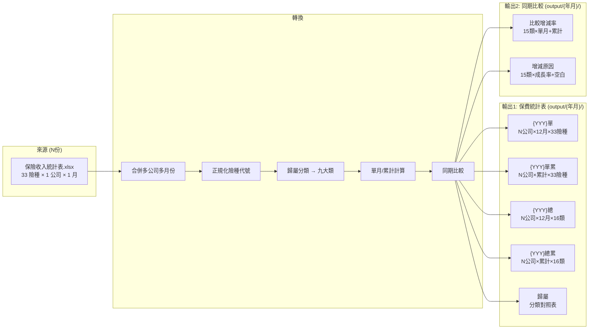
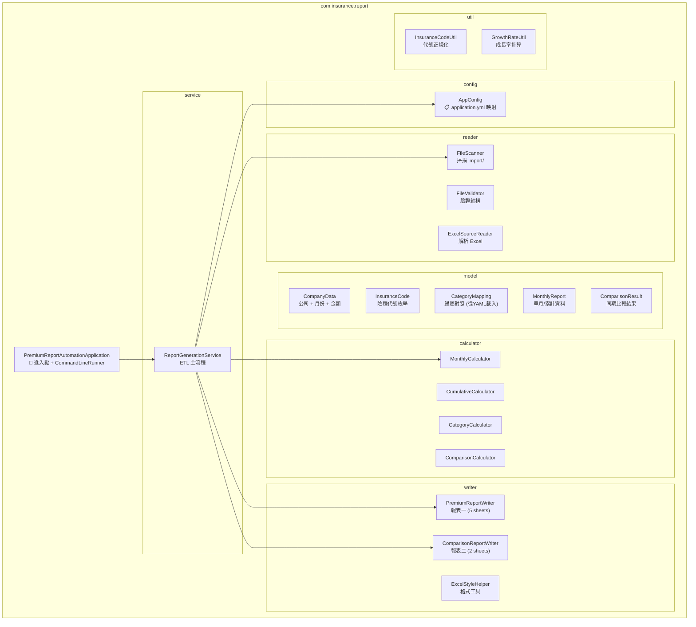

# 系統架構文件

> 本文件包含以 Mermaid 撰寫的架構圖、時序圖、邏輯圖。
> 可在 GitHub、VS Code (Mermaid Preview 插件)、或任何 Mermaid 渲染器中檢視。

---

## 一、系統架構圖 (Architecture)

---

## 二、ETL 處理時序圖 (Sequence)

---

## 三、成長率計算邏輯圖 (Logic)

---

## 四、資料流程圖 (Data Flow)

---

## 五、套件結構圖 (Package)

